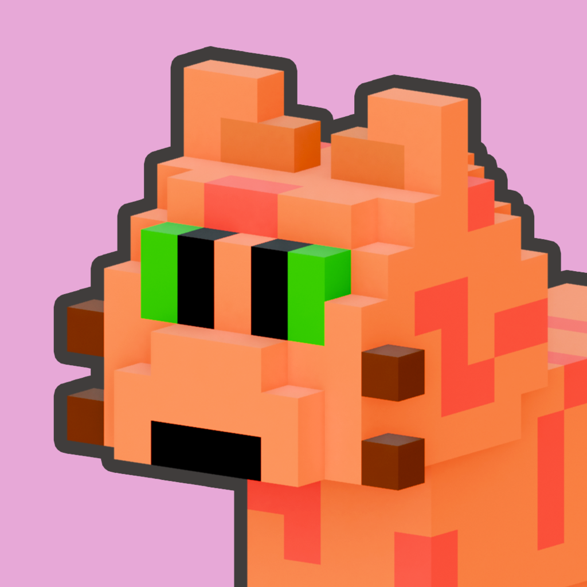

**Cat Hatch: Idle Pet Game** is a game I've been working on for the past few weeks.
It was intended to solve a simple problem: That I had never released a proper commercial game onto the App Store.

With work on my other game OlderQuest progressing, I was really aware that there were all these unknowns related to launching an app.
If I spent ages turning OlderQuest into the best game I could, only to then dump it onto the App Store after a chaotic release, it was never going to perform like I hoped.
Not to mention I have my own game engine and tech stack, so I really needed an organic platform to test it on.

## The Plan

The plan was simple: Make the game as quickly as I could based on my engine and all the code I've amassed for OlderQuest.
This way I would be able to get my experience with the Apple App Store while also testing my codebase.

The idea for Cat Hatch was a clicker game with collectable elements.
The player taps an egg and when it breaks they get a cat.
The game was about collecting all the different cats, sort of like a pokémon game.

## Early Development

With the idea in my head, early development of Cat Hatch was pretty hectic.
As someone who's entire background was in software engineering, it's been a weird few years, as there are now these robots that can write code for you!
They're all the rage at the moment, and I've been using AI tools largely since they arrived.
Cat Hatch became one of the first projects I ever took on where AI wrote most of the code.
I want to be at the cusp of the latest technolgies for development, even if they are a bit existential.
Although, if you're also a software engineer, perhaps don't worry too much because I can tell you, I've seen better code in my time.

With quite a short development window, the game started off re-using assets from OlderQuest while I got the basic ideas in place.



I wanted to try and let the AI system manage the code as much as possible, and I ended up with a really un-maintainable mess (although it did run).
However the benefit of this was that I was able to move really quickly and get the new ideas in place.
Part of the problem I am having is that AI isn't really that knowledgeable about my game engine, so it didn't always do a good job.
It would often hallucinate API functions or say a block of code was perfect when it obviously wasn't.
I built systems into the engine to allow Claude to start the game up and inspect the errors, but sometimes it would even hallucinate the command to run the engine and then tell me all was well with the game after the engine process didn't even start.
Having said that, these systems are clearly much better than they were even a year ago.

## Progress and Implementation

Progress on the game was quite quick, but this is a simple game.



Ironically it might've just been easier and quicker to code the thing completely myself.
One thing the AI system did help out with though was implementing new features into my engine.
For example, it implemented support for Apple Store Kit really quickly, which I'm glad I didn't have to do.
The cat models were all completely made by hand using the same art pipeline I used in OlderQuest.

Towards the end I was having to go in and fix Claude's GUI issues by hand.
I put this down in part to my engine api being quite unique.
If I had no experience at programming I'm not sure I actually would've been able to get this thing over the line at all.

I ended up with something I was pleased with, but mostly because it served its purpose as a technical game.



The gameplay itself is simple but it could be much deeper.
This is my first proper game release however, so I think for this one I'm happy.

## Moving Forward

My plan now is just to keep making games.
I've already got another I'm prototyping as I write this, where I'm focusing on getting an interesting art style and also fun gameplay.
One of the lessons I learned from the cat hatch game is to prototype the gameplay really quickly so you know how fun it is.
I've really tried to incorporate that learning in this new project by using web technologies to prototype the gameplay first.
I should be talking a bit about that soon!
