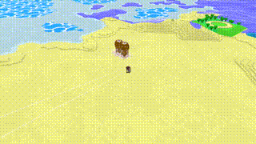
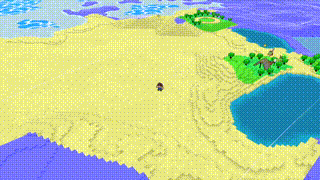
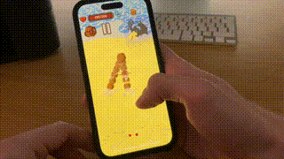

## The First Boss Battle

Recently I've been working on the first boss fight for OlderQuest: the giant sand worms! They're inspired by the creatures in *Dune* — massive, otherworldly predators that feel genuinely threatening.

### Attack Patterns

I started with a single attack pattern where the worms emerge and chomp at the player.

#### Emergence Attack

This felt too simple, so I added a secondary phase where the worms jump out of the ground in an arc, creating more dynamic combat.

#### Chomping Attack

### Visual Polish

The art style makes it easy to create impactful visuals quickly. I spent a good amount of time experimenting with the particle system to make the worm's emergence look convincing. The worms also chase the player with particle effects that communicate exactly what's happening.

#### Mobile Testing

Here's how the boss looks during mobile device testing:

### Future Work

The worms can't be killed yet (though they can definitely kill you). I still need to programme a death animation and implement some satisfying loot rewards.

That said, I'm really happy with how this encounter has turned out so far!